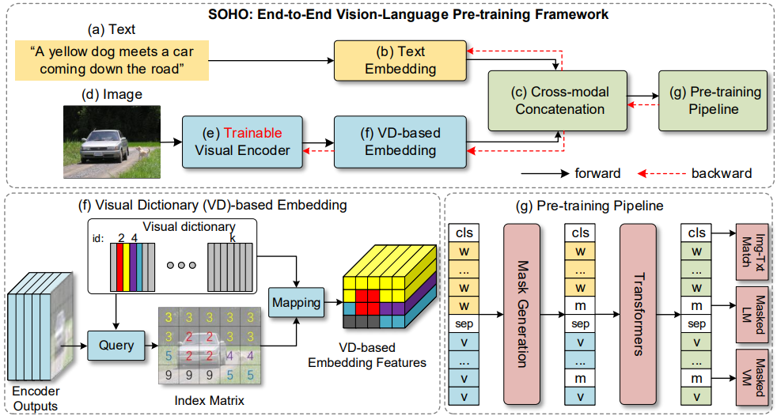

## Seeing Out of tHe bOx: End-to-End Pre-training for Vision-Language Representation Learning

By Zhicheng Huang, Zhaoyang Zeng, Yupan Huang, Bei Liu, Dongmei Fu and Jianlong Fu

#### Introduction

This is the official implementation of the paper.  In this paper,  we propose **SOHO** to "**S**ee **O**ut of t**H**e b**O**x" that takes a whole image as input, and learns vision-language representation in an end-to-end manner. SOHO does not require bounding box annotations which enables inference 10 times faster than region-based approaches. 

#### Architecture



#### Installation

```bash
conda create -n soho python=3.7
conda activate soho
git clone https://github.com/researchmm/soho.git
cd soho
bash tools/install.sh
```

#### Getting Started

1. Download the training, validation and test data

   ```bash
   mkdir -p $SOHO_ROOT/data/coco
   cd $SOHO_ROOT/data/coco
   # need to update
   wget https://vqasc.blob.core.windows.net/t-zhihuawork/code_10/MultiScalePretrain/data/coco/train2014.zip
   wget https://vqasc.blob.core.windows.net/t-zhihuawork/code_10/MultiScalePretrain/data/coco/val2014.zip
   wget https://vqasc.blob.core.windows.net/t-zhihuawork/code_10/MultiScalePretrain/data/coco/test2015.zip
   wget https://vqasc.blob.core.windows.net/t-zhihuawork/code_10/MultiScalePretrain/data/coco/train_data_qa_caption_new_box.json
   wget https://vqasc.blob.core.windows.net/t-zhihuawork/code_10/MultiScalePretrain/data/coco/val_data_qa_caption_new_box.json
   wget https://vqasc.blob.core.windows.net/t-zhihuawork/code_10/MultiScalePretrain/data/coco/test_data_qa.json
   ```

   

2. Download the Pre-training models

   ```bash
   cd $SOHO_ROOT
   mkdir -p $SOHO_ROOT/pretrained
   cd $SOHO_ROOT/pretrained
   # the following need to update
   wget 
   ```

3. Training a VQA model

   ```bash
   cd $SOHO_ROOT
   #use 8 GPUS to train the model
   bash tools/dist_train.sh configs/VQA/soho_res18_vqa.py 8
   ```

4. Evaluate a VQA model

   ```bash
   bash tools/dist_test_vqa.sh configs/VQA/soho_res18_vqa.py 18 8
   ```

   

#### Citing SOHO

if you find this repo useful in your research, please consider citing:

```latex
@article{huang2021seeing,
  title={Seeing Out of tHe bOx: End-to-End Pre-training for Vision-Language Representation Learning},
  author={Huang, Zhicheng and Zeng, Zhaoyang and Huang, Yupan and Liu, Bei and Fu, Dongmei and Fu, Jianlong},
  booktitle={The IEEE Conference on Computer Vision and Pattern Recognition (CVPR)},
  year={2021}
}
```

####  Acknowledgements

We would like to thank [mmcv](https://github.com/open-mmlab/mmcv) and [mmdetection](https://github.com/open-mmlab/mmdetection). Our commons lib is based on mmcv. 